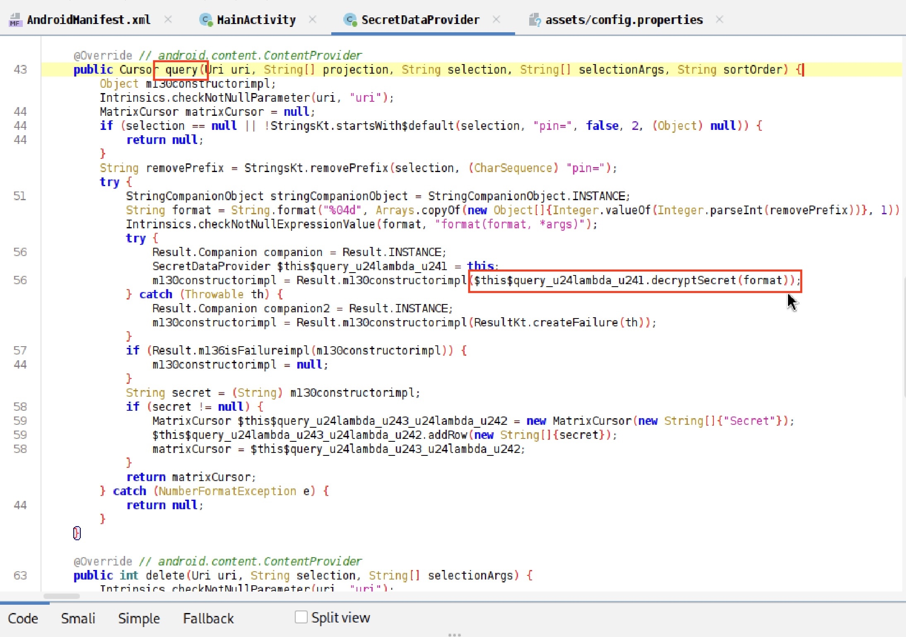

# Mobile Hacking Lab

## Lab - Secure Notes


---

## Writeup

1. I started by opening the application and observing its behavior. It can be seen that it has a textbox that we can input the 4-digit pin. When I inputted some numbers, it showed `[ERROR: Incorrect PIN]`


2. Started to reverse engineer the application using JADX and observed `AndroidManifest.xml` file for the component that is exported (`exported="true"`). Saw the Content Provider named `SecretDataProvider` that is exported.


3. Looked at the `MainActivity` class.


4. When the pin is entered, it called `querySecretProvider(enteredPin)` method using the entered pin as the input.


5. The method queries the Content Provider and displays some secret text if the provided pin is correct.


6. Looked inside the `SecretDataProvider` class and saw that it opened `config.properties` of assets.
- In `assets/config.properties` has key-value pairs having base64-encoded values.
- it decodes each value and set to its own properties (`encryptedSecret`, `salt`, `iv`, and `iterationCount`), respectively.


7. Inside the `query()` method, it calls `decryptSecret(format)` with the formatted pin as the input.



8. In the `decryptSecret()` method, it derives the pin into the decryption key and tries decrypting the encrypted secret (`this.encryptedSecret`). If successful, it returns the decrypted string; otherwise, it returns `null`.


9. After observing the decompiled code for a while and not seeing any hardcoded pin, I decided to brute force the pin since it is only 4 digits of integer.

10. I tried to create the [Frida script](script.js) to brute force the pin by repeatedly calling the `decryptSecret(pin)` method where `pin` values from 0000 to 9999.
- If the method can decrypt the `encryptedSecret` and return the result with some value (not null, not evaluated to false), it will log out the valid pin to the output. 
- Moreover, I also have it filtering out the output with replacement character (`\uFFFD`, to replace character with unknown value or unrepresentable in Unicode) for the case that it can decrypt but return unreadable output since the pin is not correct.
- I tried to call the method in 2 ways (for practicing purpose): 
1) Enumerating the existing instance of `SecretDataProvider` and invoking its `decryptSecret(pin)` method.

```javascript
function enumerateExistingInstance() {
    setTimeout(function () {     // Delay for the instance to be created
        Java.choose("com.mobilehackinglab.securenotes.SecretDataProvider", {
            onMatch(instance) {
                console.log("[+] Found: " + instance);
                console.log("[+] Start to brute-force the pin ...");
                for (let  i=0; i<=9999; i++) {
                    let paddedPin = String(i).padStart(4, '0');
                    console.log("Pin: " + paddedPin);
                    let result = instance.decryptSecret(paddedPin);
                    if (result && !(result.includes("\uFFFD"))) {    // Filter out unreadable strings
                        console.log("[+] " + paddedPin + " : " + result);
                        break;
                    }
                }
            },
            onComplete() {
                console.log("[-] Instance enumeration completed");
            }
        });
        
    }, 1000);
}
```


2) Hooking the `decryptSecret` method of `SecretDataProvider` class so that when the application calls that method (when we clicked "Submit"), it will brute force for the correct pin first and return the decrypted output to the application.

```javascript
function hookMethod() {
    const SecretDataProvider = Java.use("com.mobilehackinglab.securenotes.SecretDataProvider");
    SecretDataProvider.decryptSecret.implementation = function (originalPin) {
        console.log("[+] Hook SecretDataProvider.decryptSecret()");

        for (let  i=0; i<=9999; i++) {
            let paddedPin = String(i).padStart(4, '0');
            console.log("Pin: " + paddedPin);
            let result = this.decryptSecret(paddedPin);
            if (result && !(result.includes("\uFFFD"))) {   // Filter out unreadable strings
                console.log("[+] " + paddedPin + " : " + result);
                return this.decryptSecret(paddedPin);
            }
        }
        
        return this.decryptSecret(originalPin);
    }
}
```


11. Alternatively, I created a [Bash script](bash_script.sh) to brute-force the correct PIN by repeatedly querying the exposed content provider:
```bash
#!/bin/bash

echo "[+] Starting PIN brute-force ..."

for i in $(seq -w 0000 9999); do
    echo -n "Trying PIN: $i "
    adb shell content query --uri "content://com.mobilehackinglab.securenotes.secretprovider" --where "pin=$i" \
            | grep "Row" \
            | grep -v "$(echo -e '\uFFFD')" && break
    echo ''
done

echo "[+] PIN brute-force completed"
```
- Filter only the output that has "Row" in it indicating that it can decrypt the encrypted secret and retrieve one.
- Also filter out the output that has the character with unknown value, same as in Frida script.
- ***But I don't know why querying using command is very slow.


12. The correct pin is `2580`, and the flag is `CTF{D1d_y0u_gu3ss_1t!1?}`

---

## Scripts

[Frida script](script.js)

[Bash script](bash_script.sh)

---

