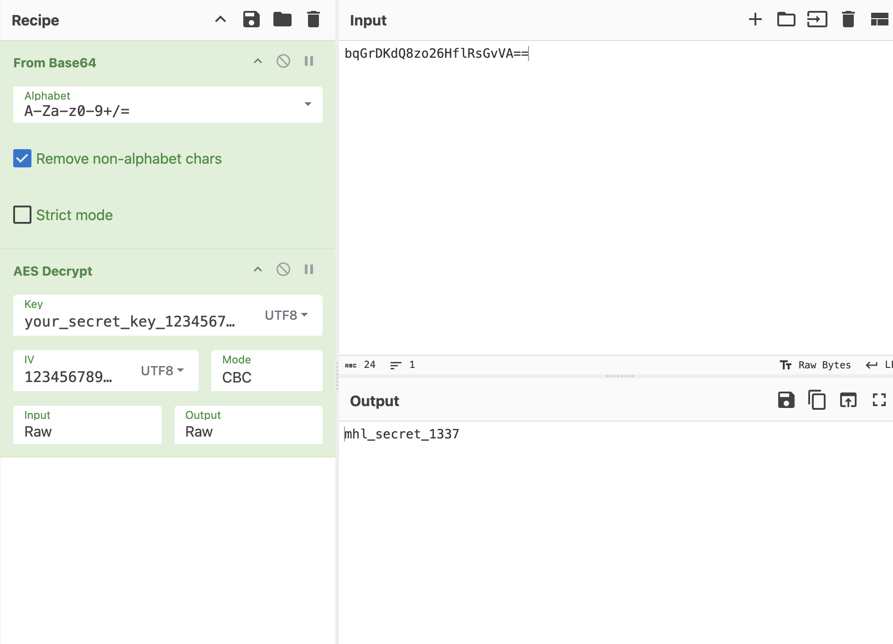
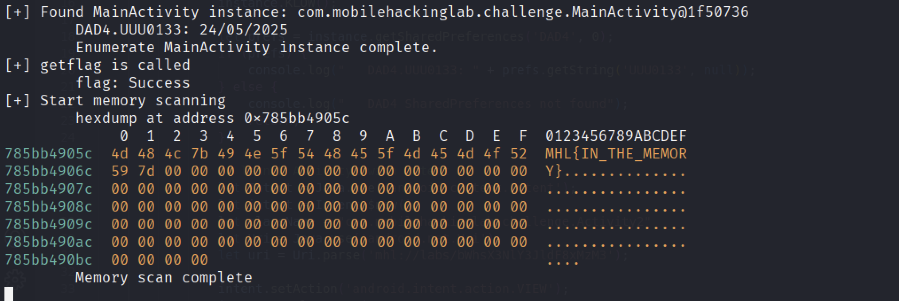
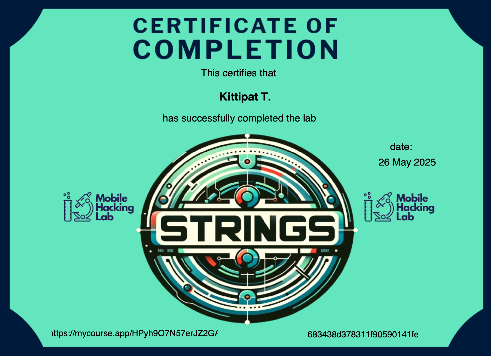

# Mobile Hacking Lab

## Lab - Strings

This lab from Mobile Hacking Lab focuses on Android intents and provides hands-on practice with Frida APIs for dynamic analysis. The goal is to locate a flag in the format MHL{...} by reversing the APK, analyzing exported activities, and using Frida to inspect runtime behavior.

### Learning Outcomes

- Gained an understanding of Android intents and intent filters
- Gained practical experience using Frida APIs for dynamic analysis and hooking
- Learned how data is stored and accessed using Android shared preferences

For full lab instructions, see: [Lab - Strings](https://www.mobilehackinglab.com/course/lab-strings)

---

## Short Writeup

- Opened the application and saw nothing
- Examined its decompiled code and manifest file using JADX
- Saw Activity2 is exported (`exported="true"`)
- Tried launching the Activity2 using `am` but it crashed
- Looked at the decompiled code of MainActivity and saw unused method `KLOW` that sets the value in the SharedPreferences
- Examined how Activity2 works
- Realized that it checks for some conditions:    
    - need to launch the activity with appropriate intent action    
    - the value of `UUU0133` in SharedPreferences needs to match in the correct format (today's date dd/MM/yyyy)    
    - the data URI for the intent needs to be in this format `mhl://labs/<base64>`   
    - base64 in data URI must be base64-encoded of correct string
- The correct string to be encoded can be found by decrypting the found based64 string `bqGrDKdQ8zo26HflRsGvVA==` using AES CBC mode
- The key and iv can be found in the decompiled code: 
    - key: `your_secret_key_1234567890123456`
    - iv: `1234567890123456`
- I used CyberChef to decrypt and the result is `mhl_secret_1337` (base64: `bWhsX3NlY3JldF8xMzM3`)

- If all conditions are passed, it will invoke the native method `getflag` from native library; otherwise, it will exit the application

---

- Start to implement the [Frida script](script.js)
- To summarize, the script does these:
1. Hook the getflag method to see the return value
2. Enumerate for MainActivity instance in the memory and call `KLOW()` to properly set the value in SharedPreferences DAD4
3. Launch Activity2 with intent (action: `android.intent.action.VIEW`, data URI: `mhl://labs/bWhsX3NlY3JldF8xMzM3`)
4. Wait for getflag to get called and realize that it is inside the memory as hinted, not shown on the screen
5. Scan the memory for pattern `MHL{`
6. Dump the hex on the found address
7. Get the actual flag `MHL{IN_THE_MEMORY}`

---

